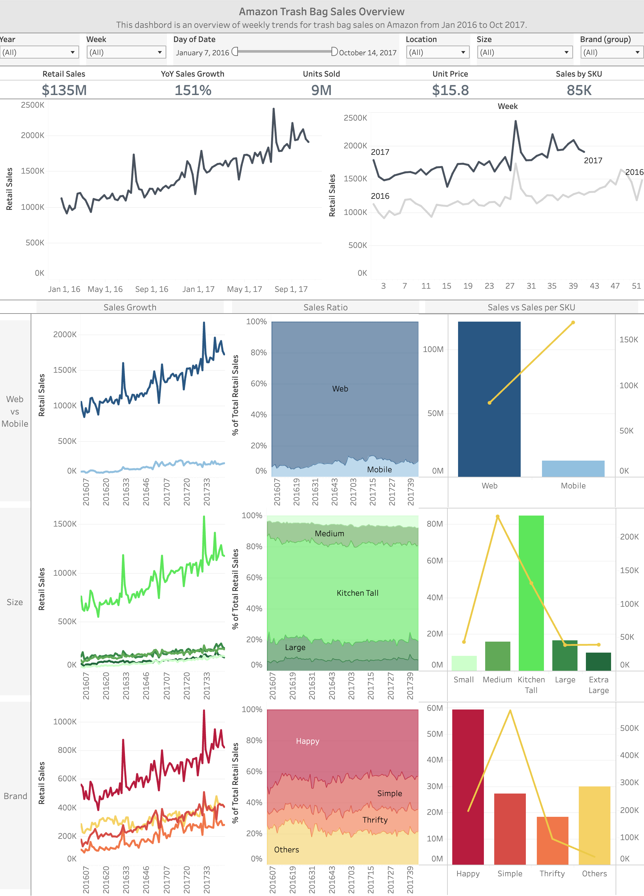

# Amazon Trash Bag Sales Analysis (2016-2017)
Analyzing trash bag sales trends on Amazon US from 2016-2017. Interactive Tableau dashboard can be found here.  

# Project Background
As an example of e-commerce data analysis, this project thoroughly analyses the sales data in the **trash bag category on Amazon US** to uncover critical insights that will help both clients doing a business in this category and thinking of starting a business in this category.

Insights and recommendations are provided on the following key areas.
- Sales trends by season, channel, trash bag size, and brands.
- Potential for sales growth or lost opportunities.
- Possible product categories for newcomers to enter the market.
- Competitors analysis in product and price levels.

An interactive Tableau dashboard can be downloaded here.  
The SQL queries utilized to clean, organize, and prepare data for the dashboard can be found here.

# North Star Metrics and Dimensions
Sales: Total sales in the Trash Bag category on Amazon US.  
Location: Web, Mobile  
Size: Small, Medium, Tall Kitchen, Large, Extra Large  
Brand: Happy, Simple, Thrifty, Others(202 brands included)  

# Data Structure
The database structure as seen below consists of two tables; Sales and Date with a total row count of 82,444.

Prior to beginning the analysis, a variety of checks were conducted for quality control and familiarization with the dataset.

# Executive Summary
Since early 2016, sales have shown continuous growth, averaging a 151% year-over-year increase. Seasonal events like Amazon Prime Day and Black Friday drive significant annual sales spikes. Currently, 90% of total sales occur through Web channels, with 60% of products sold being in the Tall Kitchen size. The market is largely controlled by the three major brands, which together hold 80% of the market share, each targeting specific product sizes to differentiate their offerings.

Below is the overview page from Tableau dashboard and more examples are included throughout the report. The entire interactive dashboard can be downloaded here.

# Summary of Insights
**Web vs Mobile**
- Mobile is less competitive than web according to the higher sales per SKU in mobile, which means fewer competitors per market size, while Web sales occupies 90% of the share. It’s mainly because fewer titles are available on mobile.
- Mobile sales should have more potential if all products are also available on mobile. At the moment, only 54 titles are available on mobile, which is quite a few compared to 1312 on the web. Especially in the top 10 titles, only 5 titles are available on mobile.
- On the other hand, mobile has a higher year-over-year growth rate of 213% than web at 145%, showing mobile has future potential for sales growth.

**Size**
- Medium size can be a less competitive category because sales per SKU is the highest in medium size, while Tall Kitchen size is dominant at 62% of the share and the share ratio between each size has not changed.
- Furthermore, low-cost products have more chance to take over the medium size market because 
1. 83% of the share in the size is occupied by Simple, whose unit price is generally twice as high as the other brands.
2. The unit price in medium size is higher than in larger sizes, Tall Kitchen and Large.

**Brands**
- 78% of the share is taken by the big three brands, Happy, Simple, and Thrifty, while the other 202 brands share the remaining 22% of the share. 
- The big three brands differentiate each other by size as Happy ranks #1 in Tall Kitchen size, Simple #1 in Small & Medium sizes, and Thrifty #1 in Large and Extra Large sizes.
- Simple has the highest sales per SKU mainly because unit price of Simple is much higher than the others. It’s unsure if it stems from quality of products or amount per unit, so further research needed.

# Recommendations & Next Steps
**Overall**
- Make all products available for purchase from mobile devices because it’s twice as less competitive as web and has a higher YoY growth rate.  

**For Newcomer**
- Medium size by low unit price is the easiest area to get into the market and make revenue because medium size is the least competitive category and the category is dominant by higher unit price products than larger sizes.  

**Further Research and Discussion**
- Research products by Simple to identify if their high unit price stems from quality or quantity. If it’s coming from quality, all medium-size products on sale are high-quality, so there should be an opportunity to acquire potential demands from customers for low-cost products.
